# 旗鱼直播平台 · 全系统架构与流程图

> 本文是 [项目技术详解.md](./项目技术详解.md) 的图形化版本，全部使用 Mermaid 绘制。
> 预览方式：GitHub / Gitee 直接渲染；VS Code 安装 "Markdown Preview Mermaid Support" 插件；或直接双击 `docs/flowcharts.html` 在浏览器查看。

## 目录

1. [系统总体架构图](#一系统总体架构图)
2. [部署拓扑图](#二部署拓扑图)
3. [登录鉴权流程](#三登录鉴权流程)
4. [直播间：开播 → 推流 → 观看 全流程](#四直播间开播--推流--观看-全流程)
5. [IM 弹幕全链路](#五im-弹幕全链路)
6. [送礼全链路（幂等 + 防超扣）](#六送礼全链路幂等--防超扣)
7. [支付充值流程（状态机 + 对账）](#七支付充值流程状态机--对账)
8. [短视频发布 → 转码 → Feed 消费](#八短视频发布--转码--feed-消费)
9. [连麦信令时序](#九连麦信令时序)
10. [发号器工作原理](#十发号器工作原理)

---

## 一、系统总体架构图

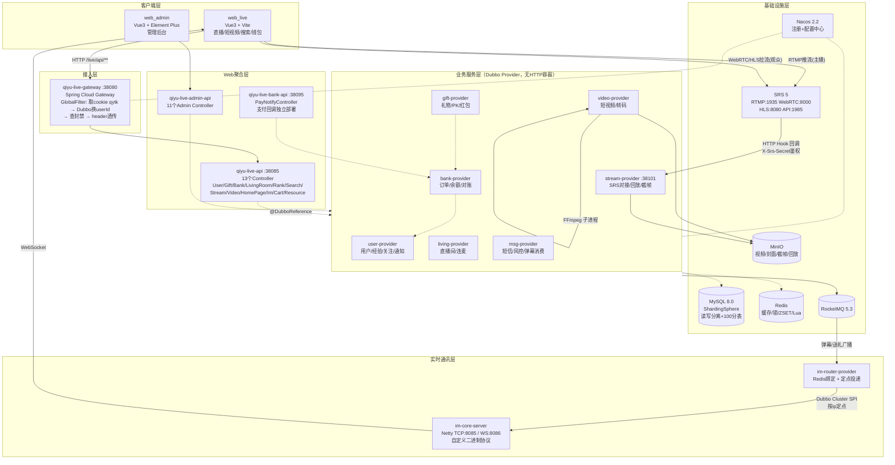

---

## 二、部署拓扑图

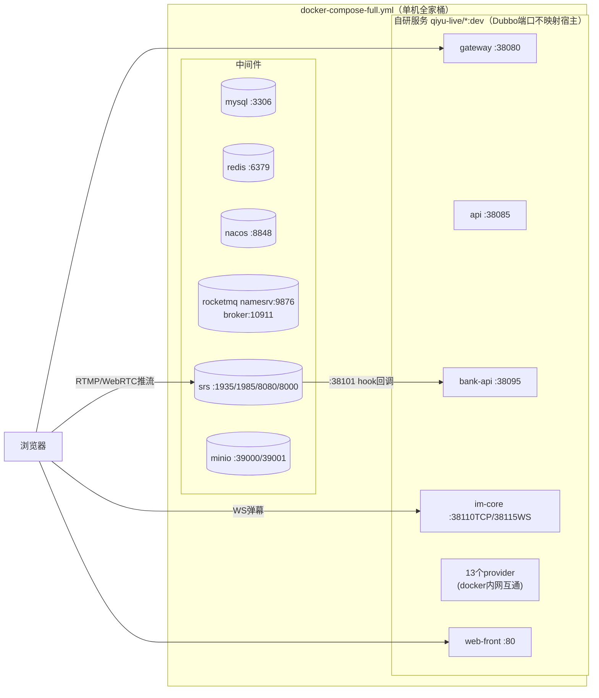

---

## 三、登录鉴权流程

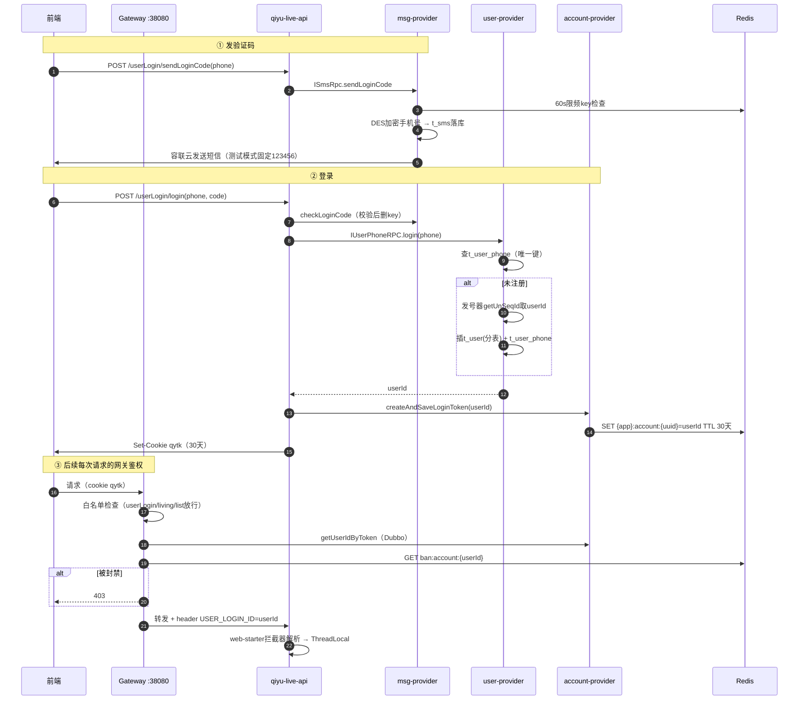

---

## 四、直播间开播 → 推流 → 观看 全流程

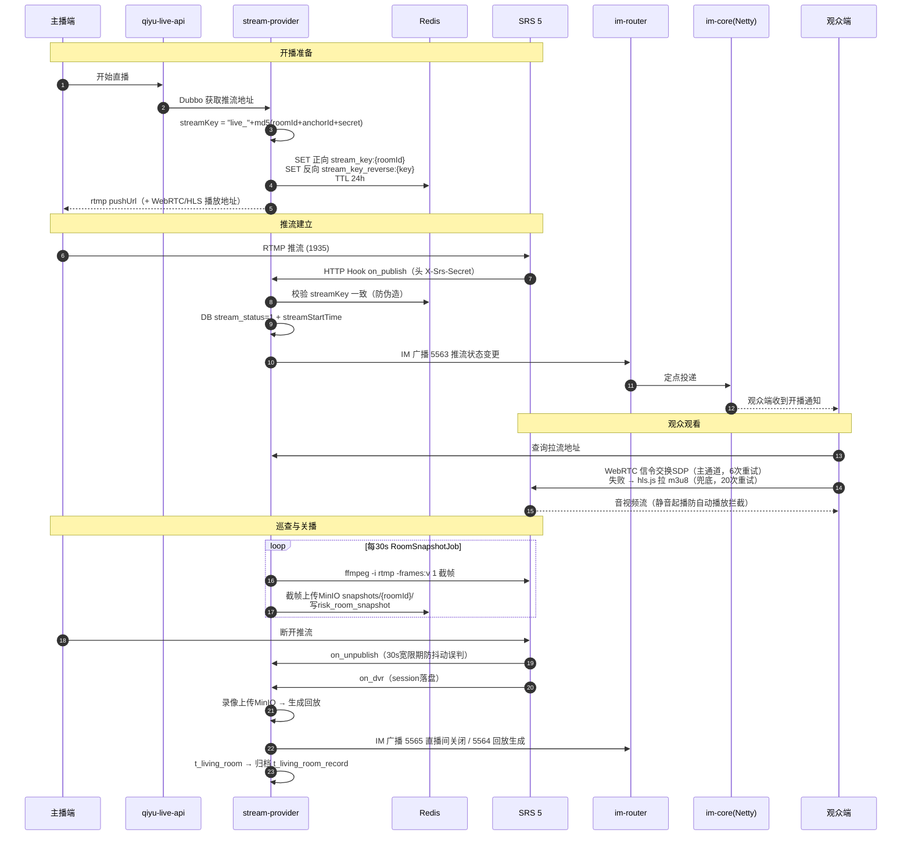

---

## 五、IM 弹幕全链路

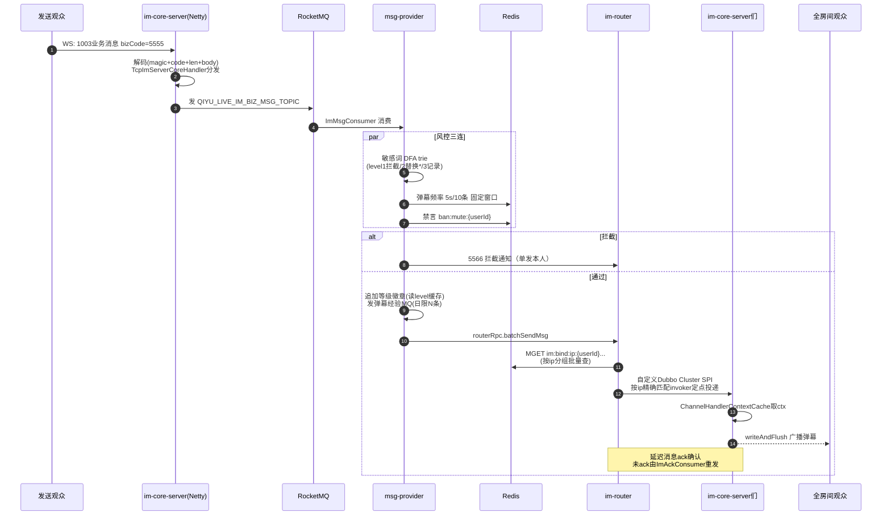

### 心跳与断连剔除（im-core 内部）

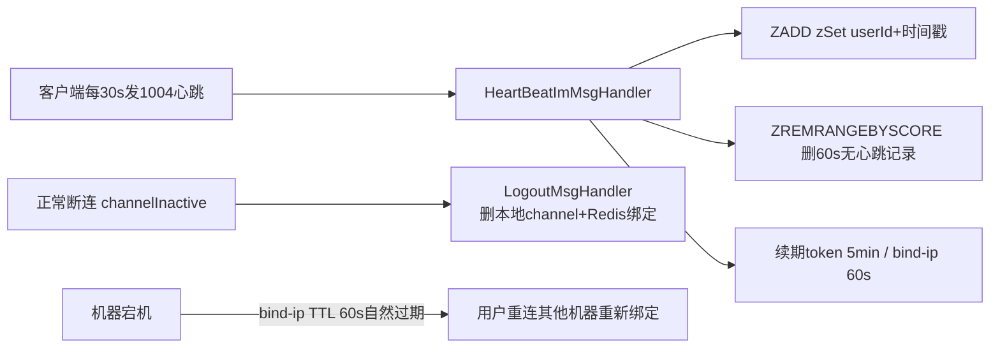

---

## 六、送礼全链路（幂等 + 防超扣）

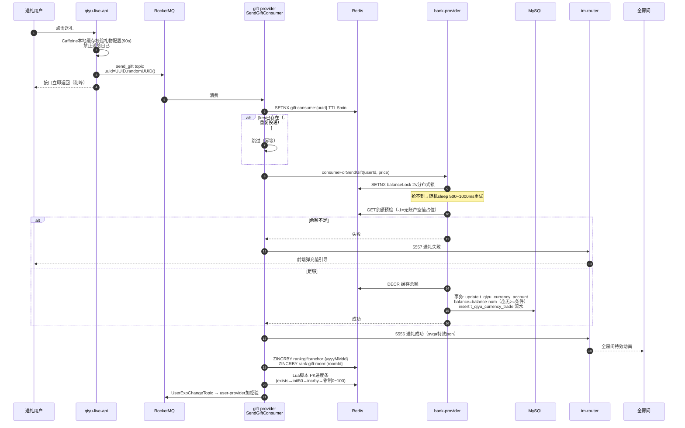

---

## 七、支付充值流程（状态机 + 对账）

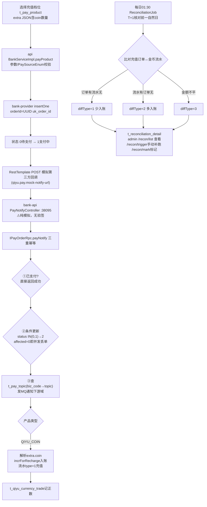

---

## 八、短视频发布 → 转码 → Feed 消费

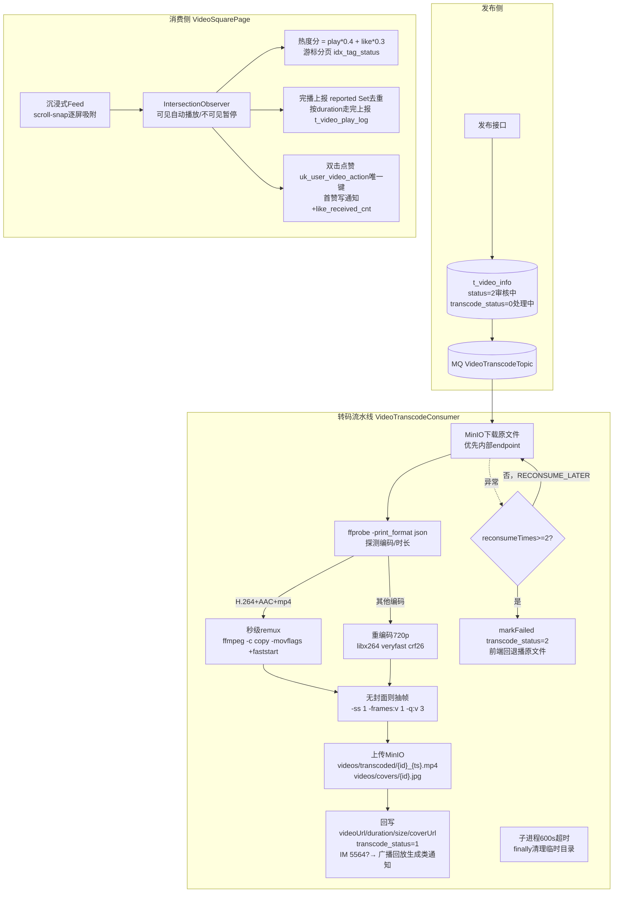

---

## 九、连麦信令时序

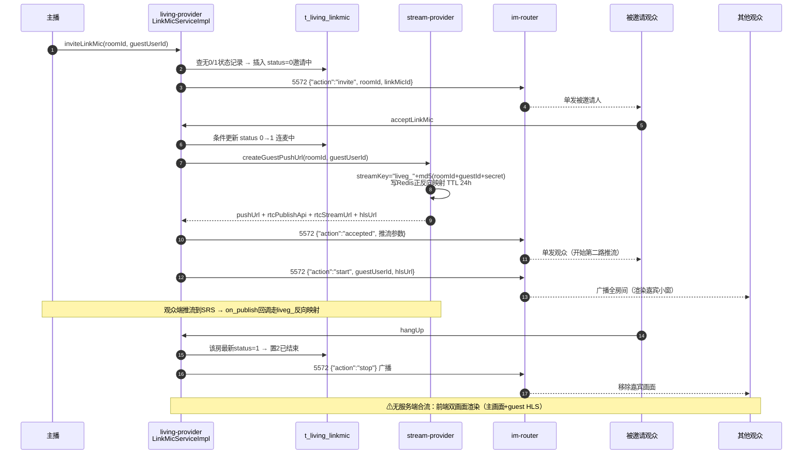

---

## 十、发号器工作原理

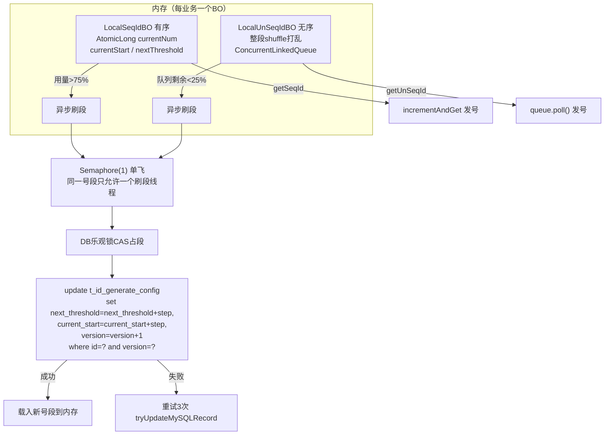

---

## 附：核心缓存 Key / MQ Topic 速查

| 类别 | Key / Topic | 用途 |
|---|---|---|
| 路由 | `qiyu:live:im:bind:ip:{appId}:{userId}` TTL 30s | 用户连在哪台 Netty 机器 |
| 登录 | `{app}:account:{token}` TTL 30天 | token → userId |
| 封禁 | `qiyu:live:ban:account/mute:{userId}` | 网关403 / 弹幕禁言 |
| 幂等 | `gift:consume:{uuid}` TTL 5min | 送礼消费去重 |
| 锁 | `{prefix}balance_lock:{userId}` TTL 2s | 扣款串行化 |
| 排行 | `qiyu-live-rank:gift:anchor:{yyyyMMdd}` / `gift:room:{roomId}` / `heat:room` | ZSET 三榜 |
| 风控 | `risk:word:version` 版本号懒重建 | 敏感词 trie 热更新 |
| MQ | `send_gift` / `UserExpChangeTopic` / `VideoTranscodeTopic` / `QIYU_LIVE_IM_BIZ_MSG_TOPIC` / `CACHE_ASYNC_DELETE_TOPIC` | 削峰/经验/转码/弹幕/缓存双删 |
