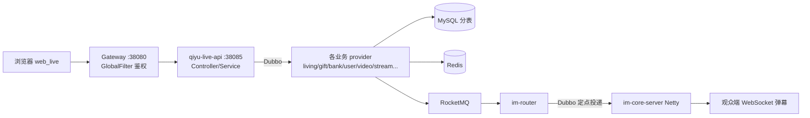
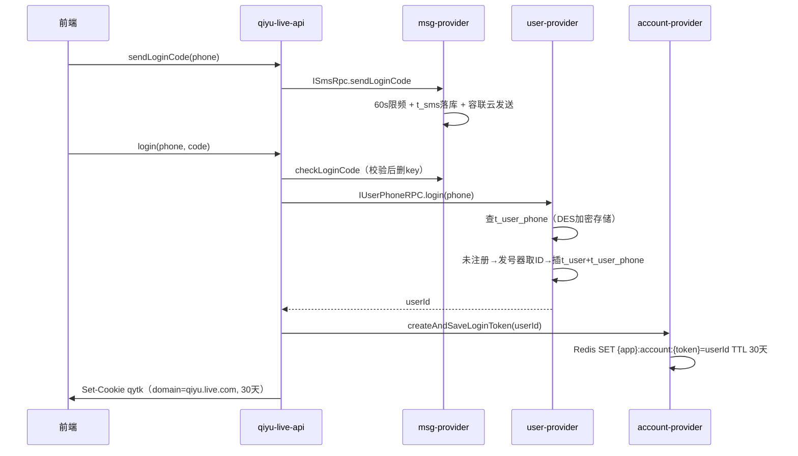
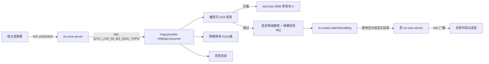
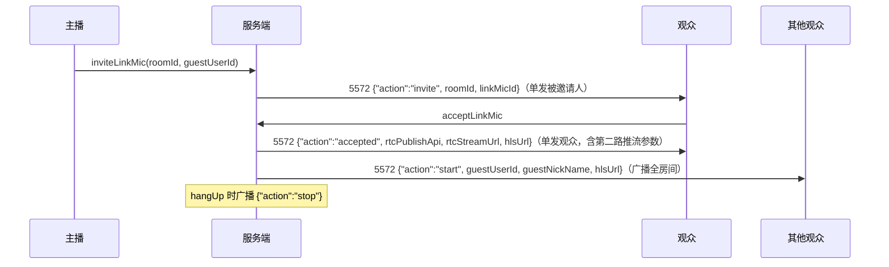
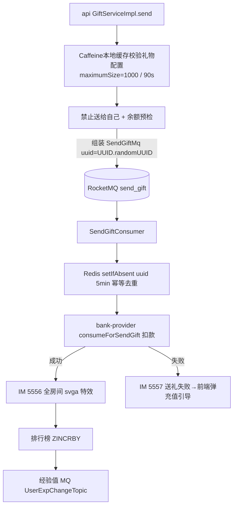
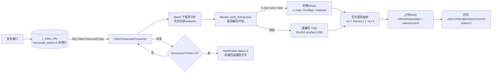

# 旗鱼直播平台 · 全功能技术详解

> 本文覆盖项目每一个功能域的实现细节：链路、关键类、缓存 Key、MQ Topic、表结构、设计取舍。
> 所有内容均来自源码与配置的实际确认，可作为学习笔记与面试讲解底稿。
> 配套文档：`docs/ports.md`（端口总表）、`docs/db-design.md`、`docs/streaming-architecture.md`、`docs/startup.md`、`docs/troubleshooting.md`。

---

## 目录

1. [项目全景与分层架构](#一项目全景与分层架构)
2. [公共框架（framework starter）](#二公共框架framework-starter)
3. [用户注册与登录（user + account + msg 短信）](#三用户注册与登录)
4. [网关鉴权（qiyu-live-gateway）](#四网关鉴权)
5. [分布式发号器（id-generate）](#五分布式发号器)
6. [IM 实时通讯（im-core / im-router / im）](#六im-实时通讯)
7. [直播间管理（living）](#七直播间管理)
8. [直播流媒体（stream × SRS）](#八直播流媒体stream--srs)
9. [连麦（linkmic）](#九连麦linkmic)
10. [礼物系统与 PK / 红包雨（gift）](#十礼物系统与pk--红包雨)
11. [余额账户与防超扣（bank 货币域）](#十一余额账户与防超扣)
12. [支付与充值（bank 订单域 + bank-api）](#十二支付与充值)
13. [对账（Reconciliation）](#十三对账)
14. [排行榜（纯 Redis ZSET）](#十四排行榜)
15. [经验值与等级体系（user）](#十五经验值与等级体系)
16. [关注关系与通知中心](#十六关注关系与通知中心)
17. [短视频（video：转码流水线 / Feed / 互动）](#十七短视频)
18. [全局搜索](#十八全局搜索)
19. [风控体系（敏感词 / 频率 / 禁言封号 / 直播巡查）](#十九风控体系)
20. [管理后台（admin-api × web_admin）](#二十管理后台)
21. [前端 web_live 关键实现](#二十一前端-web_live-关键实现)
22. [数据库设计汇总](#二十二数据库设计汇总)
23. [部署与端口](#二十三部署与端口)
24. [已知取舍与改进方向清单](#二十四已知取舍与改进方向清单)

---

## 一、项目全景与分层架构

### 1.1 技术栈

| 层 | 选型 |
|---|---|
| 语言/框架 | Java 17 + Spring Boot 3.0.4 |
| RPC | Dubbo 3.2（dubbo 协议，`@DubboService` / `@DubboReference(check=false)`） |
| 注册/配置中心 | Nacos 2.2（namespace `qiyu-live-test`，配置全量托管在 nacos-config/） |
| 网关 | Spring Cloud Gateway（GlobalFilter 鉴权） |
| 长连接 | Netty（TCP 8085 / WebSocket 8086，自定义二进制协议） |
| 流媒体 | SRS 5（RTMP 1935 / HTTP-API 1985 / HLS 8080 / WebRTC UDP 8000） |
| 对象存储 | MinIO（视频/封面/截帧/回放） |
| 消息队列 | RocketMQ 5.3（削峰/解耦/异步转码/经验值/风控） |
| 数据库 | MySQL 8.0 + ShardingSphere（读写分离 + 100 分表） |
| 缓存 | Redis（缓存 / 分布式锁 / ZSET 排行 / Lua / 心跳路由） |

### 1.2 模块分层模式（所有业务域统一）

```text
*-interface   纯 POJO：RPC 接口、DTO、枚举、常量（无任何注解，供消费方轻量依赖）
*-provider    业务实现：@DubboService 暴露，WebApplicationType.NONE（无 HTTP 容器）
              代码分包：rpc（Dubbo 实现）/ service（内部业务）/ dao（MyBatis mapper+PO）/ consumer（MQ）/ job（定时）
*-api         Web 层：唯一有 HTTP 端口的业务模块，@DubboReference 注入远程服务
```

### 1.3 一次典型请求的完整路径



### 1.4 服务清单（14 个可部署服务 + 2 前端）

| 服务 | 职责 | Dubbo 端口 | HTTP 端口 |
|---|---|---|---|
| qiyu-live-gateway | 统一鉴权/白名单/CORS | - | 38080 |
| qiyu-live-api | C 端聚合 API（13 个 Controller） | - | 38085 |
| qiyu-live-bank-api | 支付回调端点（独立部署隔离） | - | 38095 |
| qiyu-live-admin-api | 管理后台 API（11 个 Controller） | - | - |
| account-provider | 登录 token | 30015 | - |
| user-provider | 用户/经验/关注/通知 | 30030 | - |
| living-provider | 直播间/连麦 | 30045 | - |
| stream-provider | SRS 对接/推拉流/回放/截帧 | 30065 | 38101（SRS 回调） |
| gift-provider | 礼物配置/送礼 MQ 消费 | 30055 | - |
| bank-provider | 支付订单/余额账户/对账 | 30010 | - |
| video-provider | 短视频/转码 | 30060 | - |
| msg-provider | 短信/内容风控/弹幕消费 | 30050 | - |
| im-provider | IM 业务处理 | 30025 | - |
| im-router-provider | 连接路由 | 30040 | - |
| im-core-server | Netty 长连接 | 30035 | 38110(TCP)/38115(WS) |
| id-generate-provider | 发号器 | 30020 | - |
| web_live / web_admin | Vue3 前端 | - | - |

> 端口编号规则：Dubbo 端口 30010 起步长 5，详见 `docs/ports.md`。

---

## 二、公共框架（framework starter）

五个自定义 Spring Boot Starter，业务模块只引依赖不写配置。

### 2.1 bootstrap-starter

- **Provider 启动自检**：`QiyuProviderStartupVerifier`（由 `QiyuStartupVerifyAutoConfiguration` 注册为 ApplicationRunner）。启动时检查：所有 `@DubboService` 是否成功暴露、是否注册到 Nacos、所有 `@DubboReference` 下游是否可用、MySQL/Redis 是否连通；任一失败打印清单并 `exit(1)`。
- 配置项：`qiyu.startup.verify`、`strict-references`、`ignore-references`、`check-timeout-seconds`。
- **学习点**：微服务"带病启动"是排错黑洞，启动期 fail-fast 比运行时报错省得多。

### 2.2 datasource-starter

- **核心扩展点**：`NacosDriverURLProvider` 实现 ShardingSphere 的 `ShardingSphereDriverURLProvider` SPI——识别 `jdbc:shardingsphere:nacos:` 前缀，从 Nacos `DEFAULT_GROUP` 拉取 dataId（如 `qiyu-live-user-shardingjdbc.yaml`）的 YAML 字节流作为分片配置。**这就是"分片配置托管 Nacos"的实现方式**。
- `ShardingJdbcDatasourceAutoInitConnectionConfig`：ApplicationRunner 提前 `getConnection()` 预热连接池（ShardingSphere 元数据加载较慢，避免首个请求超时）。

### 2.3 redis-starter

- `RedisConfig`：`RedisTemplate<String,Object>`，key/hashKey 用 `StringRedisSerializer`，value 用自研 `IGenericJackson2JsonRedisSerializer`（Jackson 工厂）。
- `RedisKeyBuilder` 抽象基类：prefix 自动取 `spring.application.name`，通过 `RedisKeyLoadMatch`（`@Conditional`）按应用装配对应 KeyBuilder——目前有 User/Bank/Gift/Im/ImCoreServer/Living/Msg/Account 八个。
- **学习点**：Key 统一带应用前缀 + 集中在 KeyBuilder 管理，避免多服务 key 冲突和魔法字符串。

### 2.4 mq-starter

- `RocketMQProducerConfig` 统一装配 `DefaultMQProducer`（group/nameSrv/retry 走 `RocketMQProducerProperties`，`retryAnotherBrokerWhenNotStoreOK=true`，异步发送专用线程池 核数×2~100）。
- **消费端没有统一封装**：各 provider 用 `InitializingBean` 自建 `DefaultMQPushConsumer`（如 `UserExpChangeConsumer`）——这点和很多"框架封死消费端"的做法不同，灵活但重复。

### 2.5 web-starter

- `QiyuUserInfoInterceptor`：从网关写入的请求头 `GatewayHeaderEnum.USER_LOGIN_ID` 解析 userId 放入 `QiyuRequestContext`（基于 `InheritableThreadLocalMap`，支持父子线程传递）。
- `@RequestLimit` + `RequestLimitInterceptor`：接口限流注解。
- `GlobalExceptionHandler` / `ErrorAssert` / `QiyuBaseError` / `BizBaseErrorEnum`：统一异常与错误码。
- 统一响应包装：`WebResponseVO`（common-interface）。

---

## 三、用户注册与登录

### 3.1 链路（验证码登录，未注册自动注册）



### 3.2 关键实现

- **手机号 DES 加密存储**（`DESUtils.encrypt`），落 `t_user_phone`（独立未分表，`udx_phone` 唯一键）——因为 `t_user` 拆了 100 张表后全局唯一约束做不了，把"唯一且用于登录查询"的属性抽到独立表。
- **token 机制**：单 token，`UUID.randomUUID()`，Redis string，TTL 30 天，校验直接 get 反查。没有双 token / 刷新机制。
- **手机号缓存**：`buildUserPhoneObjKey(phone)` 30min；**空值缓存 5min 防缓存穿透**；另有 userId→phones 的 List 结构缓存。
- **分表下批量查用户**（`UserServiceImpl.batchQueryUserInfo`，经典题）：
  1. Redis multiGet 批量取缓存，找出 miss 的 userId；
  2. miss 的按 `userId % 100` 分组，`parallelStream` 多线程查各自分表（**替代跨 100 表的 union all**）；
  3. 结果 multiSet 回填缓存，**TTL 加随机偏移（30~38min）防缓存雪崩**。
- **缓存更新策略**：写库后不更新缓存，发 `CACHE_ASYNC_DELETE_TOPIC` **延迟 1s 二次删除**（应对主从延迟下旧值回填）。

> **学习点**：缓存三大件（穿透=空值缓存、雪崩=随机TTL、不一致=延迟双删）在这个项目里都有落点，面试可直接引用。

---

## 四、网关鉴权

### 4.1 `AccountCheckFilter`（GlobalFilter，Ordered=0）

1. 先写 CORS 头（allow origin `http://web.qiyu.live.com:5500`）；
2. 白名单（`GatewayApplicationProperties.notCheckUrlList`）：`/live/api/userLogin/**`、`/live/api/living/list/**` 直接放行；
3. 取 token：先 cookie `qytk`，回退请求头 `token`；没有返回 401 JSON `{"code":401,"msg":"token invalid"}`；
4. Dubbo 调 `IAccountTokenRPC.getUserIdByToken` 换 userId；
5. 查封禁 Redis key `ban:account:{userId}`，命中返回 403；
6. 通过后把 userId 写入请求头（`GatewayHeaderEnum.USER_LOGIN_ID`）传下游，下游 web-starter 拦截器解析进 ThreadLocal。

### 4.2 路由配置

只配一条：`uri: lb://qiyu-live-api`，`Path=/live/api/**`（lb 走 Nacos 注册中心负载均衡）。

> **学习点**：网关只做"认证 + 透传身份"，业务授权下沉到各 api 模块；身份用内部 header 传递，下游不再需要查 token（信任边界在内网）。

---

## 五、分布式发号器

**DB 号段模式**（不是雪花），核心类 `IdGenerateServiceImpl`，配置表 `t_id_generate_config`。

### 5.1 两种 ID

| 类型 | 实现 | 适用场景 |
|---|---|---|
| 有序号段 `LocalSeqIdBO` | 号段载入内存 `AtomicLong`，`incrementAndGet` 发号 | 需要趋势递增的 ID（对 InnoDB 主键友好） |
| 无序号段 `LocalUnSeqIdBO` | 整段 ID `Collections.shuffle` 打乱后放 `ConcurrentLinkedQueue`，取时 poll | 礼物流水等不希望暴露业务量的 ID |

### 5.2 号段加载与并发控制

- 服务启动（`InitializingBean`）即抢占第一段，避免首个请求同步查库；
- **异步预取**：有序段用量超过号段长度 **75%**（`UPDATE_RATE=0.75f`）触发异步刷段；无序段队列剩余 **<25%** 触发；
- **单飞**：每个号段一把 `Semaphore(1)`（`semaphoreMap`），同一号段只允许一个线程刷段，其余线程继续用本地存量；
- **DB 占段乐观锁 CAS**：

```sql
update t_id_generate_config
set next_threshold = next_threshold + step,
    current_start  = current_start + step,
    version        = version + 1
where id = #{id} and version = #{version}
```
  失败重试 3 次（`tryUpdateMySQLRecord`）；刷段线程池自建 `ThreadPoolExecutor(8, 16, queue=1000)`。

> **学习点**：与雪花对比——号段 ID 短且趋势递增、不依赖机器时钟；代价是依赖 DB，但预取+异步刷段让单号段可用时间被拉长，DB 抖动时本地存量还能扛。不是严格双 buffer，是"单 buffer + 75% 阈值异步预取"（效果近似双 buffer）。

---

## 六、IM 实时通讯

三件套：**im-core-server**（Netty，只管连接）→ **im-router-provider**（路由）→ **im-provider**（业务）。

### 6.1 自定义二进制协议（解决粘包/拆包）

- Pipeline：`TcpImMsgDecoder → TcpImMsgEncoder → TcpImServerCoreHandler`（@Sharable）；WS 版额外有 `WsSharkHandler`。
- Decoder 继承 `ByteToMessageDecoder`，报文格式：

```text
+---------+---------+---------+-----------+
| magic   | code    | len     | body      |
| 2 bytes | 4 bytes | 4 bytes | len bytes |
+---------+---------+---------+-----------+
magic 固定 19231（ImConstants.DEFAULT_MAGIC），不符或长度不足直接 ctx.close() 防恶意报文
```

- 消息码 `ImMsgCodeEnum`：**1001 登录 / 1002 登出 / 1003 业务 / 1004 心跳 / 1005 ack**。
- 分发：`ImHandlerFactoryImpl` 注册 code→Handler 映射（Login/Logout/Biz/HeartBeat/Ack），业务消息再按 **bizCode** 二次分发：

| bizCode | 含义 | | bizCode | 含义 |
|---|---|---|---|---|
| 5555 | 直播间弹幕 | | 5562 | 订单状态变更 |
| 5556 | 送礼成功（全房间特效） | | 5563 | 推流状态变更 |
| 5557 | 送礼失败（余额不足） | | 5564 | 直播回放生成 |
| 5558 | PK 送礼 | | 5565 | 直播间关闭 |
| 5559 | PK 连线 | | 5566 | 风控拦截通知 |
| 5560/5561 | 红包雨发/领 | | 5567 | 主播开播推送 |
| 5570 | 用户升级特效 | | 5572 | 连麦信令 |

### 6.2 分布式定点投递（本项目的招牌设计）

**问题**：Netty 集群多机部署，用户 A 连在机器 1，房间广播/单发怎么精确找到机器 1？

**方案**：
1. 登录成功（`LoginMsgHandler.loginSuccessHandler`）后：
   - 本地 `ChannelHandlerContextCache.put(userId, ctx)` 缓存 channel；
   - Redis 写绑定关系：key `qiyu:live:im:bind:ip:{appId}:{userId}`，value = `dubbo注册ip:port`，**TTL 30s**（心跳续命）；
2. 下发消息时（`ImRouterServiceImpl.sendMsg`）查 Redis 拿目标机器地址；
3. **自定义 Dubbo 集群扩展 SPI**：`ImRouterCluster` / `ImRouterClusterInvoker`（注册于 `META-INF/dubbo/internal/org.apache.dubbo.rpc.cluster.Cluster`，扩展名 `imRouter`）——按 ip **精确匹配 invoker 地址**实现定点投递，绕过普通负载均衡。`RpcContext.getContext().set("ip", bindAddress)` 传目标地址；
4. 到达目标机器：`RouterHandlerRpcImpl → RouterHandlerServiceImpl.onReceive` → 从本地 channel 缓存取 ctx `writeAndFlush`；
5. **批量优化**：`batchSendMsg` 先按 ip 分组 → Redis multiGet 批量查绑定 → 分组投递，减少 Redis 往返；
6. **可靠投递**：`MsgAckCheckServiceImpl.recordMsgAck + sendDelayMsg` 延迟消息做 ack 确认（`ImAckConsumer` 消费未 ack 重发）。

> **学习点**：这是 Dubbo 标准用法之外的自定义扩展点（Cluster/ClusterInvoker SPI），面试讲"为什么普通 LB 不行、怎么用 SPI 精确寻址"是最出彩的一段。

### 6.3 心跳与断连剔除

- `HeartBeatImMsgHandler`：每次心跳把 `userId + 当前时间戳` 写 Redis zSet（key 由 `ImCoreServerProviderCacheKeyBuilder` 生成）；
- 同时 `removeRangeByScore(key, 0, now - 60s)` 删除 60 秒无心跳的记录——**用 zSet 的 score 天然按时间排序做滑动窗口剔除**；
- 续期：token key 续 5min，bind-ip key 续 60s；
- 正常断连：`TcpImServerCoreHandler.channelInactive` 触发 `LogoutMsgHandler`（本地缓存移除 + Redis 绑定删除）。

### 6.4 弹幕的完整链路（从发送到渲染）



---

## 七、直播间管理

- 表：`t_living_room`（房间状态/主播/stream_key）、`t_living_room_record`（**关播归档表，冷热分离**：进行中的房间在主表，历史场次归档到 record 表）。
- **进房欢迎**：进房触发 living 域广播（系统弹幕欢迎），同时人气榜 ZINCRBY。
- **在线人数**：`LivingRoomOnlineConsumer`（MQ）维护在线用户（看播同时发经验值 MQ），前端 10s 轮询接口。
- **房间贡献榜**：bizCode 5556 时本地增量刷新（RankController 查询接口配合）。
- **开播推送**：开播时 IM 广播 5567 给粉丝/在线用户（通知中心 type=4 开播通知联动）。
- 搜索直播间：`ILivingRoomRpc.searchRooms`（MySQL LIKE 过渡）。

---

## 八、直播流媒体（stream × SRS）

### 8.1 推拉流地址生成（防盗链）

```java
streamKey = "live_" + md5(roomId + anchorId + secret)   // 主播
streamKey = "liveg_" + md5(roomId + guestUserId + secret) // 连麦嘉宾
```
- secret 来自 `SrsConfig`；pushUrl = rtmpBaseUrl/streamKey（RTMP 1935）；播放支持 WebRTC（`/rtc/` 信令接口交换 SDP）与 HLS（m3u8）双通道；
- 有效期 24h（`STREAM_KEY_EXPIRE_HOURS`）；
- **Redis 双向映射**：正向 `stream_key:{roomId}`（查当前 key）、反向 `stream_key_reverse:{streamKey}`（SRS 回调时由 key 反查 roomId，兜底查 DB `t_living_room.stream_key`）；
- **校验防伪造**：on_publish 时比对请求的 streamKey 与缓存中登记的是否一致，不一致拒绝。

### 8.2 SRS HTTP Hook 回调

`SrsCallbackController`（stream-provider 独立 HTTP 端口 38101），鉴权：请求头 `X-Srs-Secret` 与 `qiyu.srs.callback-secret` 比对，失败返回 `{"code":1}` 拒绝。

| 回调 | 时机 | 处理 |
|---|---|---|
| `/on_publish` | 推流建立 | streamKey 反查 roomId → 校验一致 → DB stream_status=1 + streamStartTime → 截流上下文 → IM 广播 5563 |
| `/on_unpublish` | 推流断开 | **30s 宽限期**（GRACE_PERIOD_MS）防网络抖动误判 → 更新状态 → 广播 |
| `/on_dvr` | 关播落盘（dvr_plan=session） | 录像文件上传 MinIO → 生成回放（`LivingPlayBackRpcImpl`），广播 5564 |

> **注意**：SRS hooks 改配置后需要重启 SRS 才生效（项目踩过的坑，见 commit 记录）。

### 8.3 直播巡查截帧

`RoomSnapshotJob`：`@Scheduled(fixedDelay=30_000)`，对 `stream_status=1` 的房间逐个执行 `ffmpeg -i {rtmp} -frames:v 1 -q:v 5`（20s 超时，产物 <1KB 判失败），上传 MinIO 桶 `qiyu-live-videos` 的 `snapshots/{roomId}/`，写 `qiyu_live_common.risk_room_snapshot`（**跨库直写**）。处置流程见风控一节。

### 8.4 缓存 Key 设计（`StreamProviderCacheKeyBuilder`）

```
{prefix}stream_status:{roomId}          房间推流状态
{prefix}stream_key:{roomId}             正向 roomId→streamKey
{prefix}stream_key_reverse:{streamKey}  反向 streamKey→roomId
{prefix}record_context:{streamKey}      录制上下文
{prefix}guestStreamKey:{roomId}:{userId} 连麦嘉宾 key
```

---

## 九、连麦（linkmic）

> 当前分支开发中的功能（`sql/linkmic.sql` + living/stream/api 多模块改动）。

### 9.1 状态机

表 `t_living_linkmic`：`id / room_id / guest_user_id / status / start_time / end_time`，`idx_room_status`。

```
invite（主播邀请观众）: status=0 邀请中
accept（观众接受）    : 条件更新 0→1，status=1 连麦中
hangUp               : 取该房最新 status=1 记录置 2，status=2 已结束
```

### 9.2 信令流程（bizCode 5572）



### 9.3 第二路推流

`LivingStreamServiceImpl.createGuestPushUrl`：生成 `liveg_` 前缀 streamKey，写 Redis 正反向映射（反向供 SRS on_publish 反查），返回 RTMP pushUrl + WebRTC 发布接口 + HLS 地址。

**关键取舍：没有服务端合流（混流）**，前端双画面渲染——主画面 + guest HLS 小窗。生产级方案通常需要 SRS/云厂商混流成单路流，这是明确的可改进点。

---

## 十、礼物系统与 PK / 红包雨

### 10.1 送礼链路（MQ 异步削峰 + 幂等）



- **幂等**：MQ 可能重复投递，消费端用 Redis `setIfAbsent(buildGiftConsumeKey(uuid), 5min)` 去重，重复消息直接跳过；
- **PK 进度条**：Redis Lua 脚本（`SendGiftConsumer.LUA_SCRIPT`）——`exists → 初始化50 → incrby → 上下限钳制(0~100)`，把"判断+初始化+自增"原子化；moveStep = price/10，12h 过期；
- **红包雨**：bizCode 5560 发送（`t_red_packet_config` 配置）+ 5561 领取成功，领取用 Redis 原子操作防超领。

> **学习点**："接口快返回 + MQ 异步落账"是直播高并发场景的标准解法；幂等键（uuid）在**生产端生成**而不是消费端算 hash，语义更明确。

---

## 十一、余额账户与防超扣

表：`t_qiyu_currency_account`（**user_id 直接做主键**，一户一行天然去重）+ `t_qiyu_currency_trade`（只插不改的流水表，充值记正、送礼记负，对账依据）。

### 11.1 扣款流程（`QiyuCurrencyAccountServiceImpl.consume`）

1. **Redis 分布式锁**：`setIfAbsent(lockKey, 1, 2s)`（`BankProviderCacheKeyBuilder.buildUserBalanceLockKey`），抢不到随机 sleep 500~1000ms 递归重试；
2. 锁内 **getBalance 预检余额**，不足才失败（`-1` 是"无账户"空值占位）；
3. Redis `decrement` 扣缓存余额；
4. DB 层 `consumeDecrDBHandler` `@Transactional`：`update t_qiyu_currency_account set current_balance=current_balance-#{num} where user_id=#{userId}` + 写流水。

### 11.2 诚实的短板（面试要主动讲）

**DB 的 update 语句没有带 `where current_balance >= #{num}` 条件**——防超扣完全依赖"分布式锁 + 锁内预检"。标准加固是给 SQL 加余额条件利用行锁原子性做最后兜底（参考 `t_sku_stock_info` 的乐观锁 version 字段做法）。

> **学习点**：这里能引出"三层防超扣"知识体系：①DB 条件更新（最强，零成本）②乐观锁 version ③分布式锁串行化。项目用了③+应用层预检，缺①，属于"能跑但非生产级"的典型。

---

## 十二、支付与充值

### 12.1 下单链路

`api/service/impl/BankServiceImpl.payProduct`：

1. 参数校验（productId、`PaySourceEnum`）→ 查充值档位 `t_pay_product`（id/name/price 分/extra JSON 含 coin 数量/type/valid_status，种子数据 `sql/recharge_seed.sql`）；
2. `payOrderRpc.insertOne` 插入**待支付订单**（orderId = UUID，provider 端生成，`uk_order_id` 唯一键）；
3. `updateOrderStatus(orderId, PAYING)` 置支付中；
4. `RestTemplate` POST 到 `qiyu.pay.mock-notify-url`（默认 `http://localhost:38095/live/bank/payNotify/wxNotify`）**模拟第三方支付回调**（代码注释特意说明用 URI 对象避免参数二次编码）。

**没有真实二维码生成、没有微信/支付宝签名验签**——纯模拟实现（见二十四节改进清单）。

### 12.2 回调处理（bank-api 独立部署）

`PayNotifyController`（38095）：`POST /payNotify/wxNotify?param=...` → JSON 反序列化 `WxPayNotifyVO(orderId, userId, bizCode)` → Dubbo 调 `IPayOrderRpc.payNotify`。

> **学习点**：支付回调独立成 bank-api 服务（不与主 api 同进程）——回调入口隔离，主服务发布不影响回调接收，也让回调链路的监控/限流独立可配。

### 12.3 订单状态机（`PayOrderServiceImpl.payNotify`）

```
OrderStatusEnum：0待支付 / 1支付中 / 2已支付 / 3撤销(PAY_BACK) / 4无效
```

**三重幂等**：
1. 已支付订单重复回调直接返回成功；
2. 条件更新 `status IN (0,1) → 2` 并回填 pay_time，affected=0 即并发丢单/重复单；
3. 查 `t_pay_topic`（biz_code → topic 映射表）**发 MQ 通知其他域**（解耦"支付成功"的下游动作）。

若产品类型 `QIYU_COIN`：解析 `t_pay_product.extra` 的 `coin` 字段 → `QiyuCurrencyAccountService.incrForRecharge` 入账（流水类型 `TradeTypeEnum.LIVING_RECHARGE(1)`）。

---

## 十三、对账

- 定时任务 `bank/provider/job/ReconciliationJob`：`@Scheduled(cron="0 30 1 * * ?")`，**T+1 核对前一自然日**；
- `ReconciliationServiceImpl.reconcileDay`：比对充值订单与金币流水，差异写 `t_reconciliation_detail`（bizDate/diffType/orderId/expectNum/actualNum/status/remark）；
- 差异类型 `ReconciliationDiffTypeEnum`：1=订单有流水无（**少入账**）、2=流水有订单无（**多入账**）、3=金额不平；
- `AdminReconController`：`/recon/list`、`/recon/trigger`（手动指定日期补跑）、`/recon/mark`（标记处理）；前端 `ReconPage.vue`。
- `AdminStatsController` 仪表盘里"今日交易流水笔数"也来自 `t_qiyu_currency_trade`。

> **学习点**：资金系统的标配三件套在项目里都有落点——流水表（只插不改）+ 状态机幂等 + T+1 对账差异报表。可以讲"为什么余额不能只看余额，必须能从流水重放"。

---

## 十四、排行榜（纯 Redis ZSET）

`RankConstants` 统一前缀 `qiyu-live-rank:`，全程 `StringRedisTemplate`（**避免多服务序列化器不一致**——踩坑点）。

| 榜 | Key | member / score | TTL |
|---|---|---|---|
| 主播收礼日榜 | `gift:anchor:{yyyyMMdd}` | anchorId / 金币 | 8 天 |
| 单房间贡献榜 | `gift:room:{roomId}` | 送礼人 userId / 金币 | - |
| 人气榜 | `heat:room` | roomId / 进房人数 | - |
| 周榜 | `gift:anchor:week:{yyyyMMdd}` | anchorId / 金币 | 1 天 |

**周榜滚动是"查询时算"不是"定时任务算"**：`RankApiServiceImpl` 查询时把最近 7 个日榜 key `ZUNIONSTORE` 合并到周榜 key（TTL 1 天）。

> **学习点**：写时聚合（每天零点跑批）vs 查时聚合（ZUNIONSTORE）的权衡——前者查询快但多一个定时任务和落库成本，后者实现简单、天然容错（少一天数据只是暂时缺一天）。数据量小的时候查时聚合更优。

---

## 十五、经验值与等级体系

### 15.1 经验值生产方（4 处，统一 MQ）

全部发 `UserProviderTopicNames.USER_EXP_CHANGE_TOPIC = "UserExpChangeTopic"`，由 `UserExpChangeConsumer` 消费调 `ProfileServiceImpl.addExp`：

| 动作 | 生产方 | 规则 |
|---|---|---|
| 送礼 | gift `SendGiftConsumer` | 按金额 |
| 看播 | living `LivingRoomOnlineConsumer` | 时长 |
| 弹幕 | msg `SingleMessageHandlerImpl.sendDanmuExp` | **每日前 N 条每条 +1**，日限 key `buildDanmuExpDailyKey(userId, yyyyMMdd)` TTL 25h |
| 发视频 | `VideoApiServiceImpl` | 按次 |

### 15.2 等级计算与升级广播

- `t_user_profile_ext`（userId 主键）：follow_cnt / fans_cnt / like_received_cnt / level / exp，`exp = exp + delta` 原子更新；
- `UserLevelConstants.calcLevel`：12 级封顶，阈值 `{0,100,300,600,1000,2000,3500,6000,10000,20000,35000,60000}`；
- 升级 → 更新 level → **发 IM 5570 升级特效**：roomId 非空则查全房在线用户逐个 `routerRpc.batchSendMsg`（他人生成系统消息），否则单发本人 Toast；
- 缓存：`level:{userId}`（7 天）/ `exp:{userId}`（30 天），msg-provider 弹幕链路读取渲染**等级徽章**。

---

## 十六、关注关系与通知中心

### 16.1 关注（`UserRelationServiceImpl`）

- 表 `t_user_relation`（user_id, follow_user_id, **status 1关注/0取关**，唯一键）——取关后再关注走 status 置 1（**不删记录，保留关注历史**）；
- 同时 `t_user_profile_ext` 用 `GREATEST(0, cnt ± 1)` 原子加减 follow_cnt / fans_cnt（**防负数**）；
- 首次关注向被关注人写通知（type=2 "新的粉丝"）。

### 16.2 通知中心

- 表 `t_user_notify`：id / userId / **type(1系统 2互动 3私信 4开播通知)** / title / content / jump_url / is_read / create_time；
- 写入方：关注（type=2）、视频首赞（type=2 "收到新的点赞"），通过 `INotifyRpc.sendNotify`；
- 读取：`NotifyServiceImpl.listNotify`（MyBatis-Plus 分页按 id 倒序 + hasNext）、`unreadCount`（count is_read=0）、`markRead`（notifyId 可空=全部已读）；
- 接口：`/notify/list`、`/notify/read`、`/notify/unreadCount`，前端铃铛**轮询** unreadCount（改进方向：IM 推送未读数）。

---

## 十七、短视频

### 17.1 发布 → 异步转码流水线（状态机）



- MQ：topic `VideoTranscodeTopic`，消费组 CONSUME_FROM_LAST_OFFSET，batch=1；
- 重试：失败抛异常 → RECONSUME_LATER；`MAX_RECONSUME=2` 后置失败，**不无限重试**；
- 状态机：`t_video_info.transcode_status`：0=处理中 → 1=完成（幂等：已是 1 直接 return）/ 2=失败；
- 子进程超时 600s（`PROC_TIMEOUT_SECONDS`），finally 清理临时目录。

> **学习点**：remux vs 重编码的判断（探测编码决定 `-c copy` 还是 libx264）能节省 90% 以上转码时间；"失败回退播原文件"保证可用性优先于画质统一。

### 17.2 沉浸式 Feed

- CSS `scroll-snap-type: y mandatory` + 每 item `scroll-snap-align: start`（逐屏吸附）；
- `IntersectionObserver` 监听当前可见 item → 自动播放/暂停（不可见暂停省流量）；
- 热度分 = play×0.4 + like×0.3，游标分页（`idx_tag_status(tag_id, status, id)` 联合索引覆盖过滤+排序）；
- **完播上报**：每条视频 `reported` Set 标记，按 duration 走完上报观看时长（离开/结束时上报一次），落 `t_video_play_log`。

### 17.3 互动与表设计

- `t_video_user_action`：`uk_user_video_action(user_id, video_id, action_type)` **唯一键保证一人一视频一行为一条**（点赞 toggle）；`idx_video_action(video_id, action_type)` 反查；
- 计数列冗余（play/like/favorite/share/comment_count）避免 count 查询；点赞同步 `t_user_profile_ext.like_received_cnt`；
- 观看历史 `t_video_watch_history`；评论 `t_video_comment`；标签 `t_video_tag`；
- 视频审核流：status 扩值（2=审核中默认、3=驳回），admin `AuditPage` 队列通过/驳回。

---

## 十八、全局搜索

`SearchController`：`POST /search/all`，keyword 三分栏各取前 10：

| 栏 | RPC | 实现 |
|---|---|---|
| 直播 | `ILivingRoomRpc.searchRooms` | MySQL LIKE（代码注释明确"ES 记入远期"） |
| 视频 | `IVideoApiService.search` | LIKE + tag/status 索引 |
| 用户 | `IUserRpc.listUsers` | **纯数字则 userId 精确 OR 昵称 LIKE**，否则昵称 LIKE |

> **学习点**：LIKE 过渡是合理选择（数据量小）；被问"怎么上 ES"可以答：binlog/双写同步索引、分表场景按 userId 路由索引分片。

---

## 十九、风控体系

### 19.1 敏感词检测（手写 DFA）

- 表 `risk_sensitive_word`（msg 库）：word / **level(1拦截 2替换* 3仅记录)** / **scene(0全部 1弹幕 2昵称 3视频标题 4评论 5房间名)** / status，`uk_word_scene`，含 10 条种子词；
- 核心 `RiskCheckService`（msg-provider）：**手写 DFA trie**（`Node.children Map`），scene=0 的词合并进每个场景树；命中 level=1 立即 blocked，level=2 返回替换为 `*` 的文本，level=3 放行记录；
- **热更新**：Redis 版本号 key（`buildRiskWordVersionKey`）懒重建——admin 改词后 INCR 版本号，下次检测发现版本变化重载 trie，不用重启不用广播。

> **学习点**：DFA trie 是敏感词标准解（O(文本长度) 检测）；版本号懒重建是"配置热更新"的轻量通用模式。

### 19.2 弹幕频率与禁言

- 频率：`checkDanmuFreq` 固定窗口 **5s / 10 条**（Redis INCR+EXPIRE），超限**静默丢弃**（不打扰用户）；Redis 故障**放行**（可用性优先）；
- 禁言/封号：`t_user_ban`（type 1禁言 2封号，end_time NULL=永久，operator，status）+ Redis：`ban:account:{userId}` / `ban:mute:{userId}`，值存原因，TTL=时长秒（永久 365 天）；读方为 gateway（封号 403）与 msg-provider（禁言）。

### 19.3 直播巡查处置闭环

`AdminSnapshotController` 处理截帧工单（audit_status 筛选分页）：

| 动作 | 执行 |
|---|---|
| warn 警告 | ImRouterRpc 给主播发 5566 警告 |
| close 强关 | `livingRoomRpc.closeLiving` 强制关播 |
| ban 封号 | `userRpc.banUser` 封 1440 分钟 |
| pass | 标记正常 |

处理后 audit_status=2 并记录 handle_action。

---

## 二十、管理后台

### 20.1 admin-api

- **登录**：`AdminAuthController` → 查 `t_admin_user`（password_hash + salt）→ **SHA-256(password+salt)** 校验 → **内存 ConcurrentHashMap token**（TTL 12h，单实例设计）；`AdminAuthFilter` 校验请求头 `adminToken`。
- **运营仪表盘**：`AdminStatsController` 用 `JdbcTemplate` **跨库 4 条 COUNT**：今日新增用户（qiyu_live_user.t_user）/ 今日开播场次（qiyu_live_living.t_living_room）/ 今日充值额（qiyu_live_bank.t_pay_order join t_pay_product，status=2，分→元）/ 今日交易流水笔数（t_qiyu_currency_trade）。
- Controller 清单（11 个）：AdminAuth / AdminGiftConfig / AdminLiving / AdminPayProduct / AdminRecon / AdminRisk / AdminSnapshot / AdminStats / AdminTag / AdminUser / AdminVideo。
- 礼物配置/充值档位改动后**主动失效相关 Redis 缓存**（改价前台即时同步——Caffeine 90s + Redis 失效）。

### 20.2 web_admin

- Vue 3 + Element Plus + Vite（dev 3005），13 个页面：Dashboard / User / Living / GiftConfig / PayProduct / Tag / Video / Audit / Risk / Snapshot / Recon / Login / Layout；
- 路由守卫：`main.js` `router.beforeEach`——非 /login 且无 `localStorage.admin_token` → 跳登录；
- `api/index.js` axios 拦截器统一带 `adminToken` 请求头，后端 `AdminAuthFilter` 二次校验。

---

## 二十一、前端 web_live 关键实现

### 21.1 直播播放器（`components/LivePlayer.vue`）

- **主通道 WebRTC**：`RTCPeerConnection` + `addTransceiver('video', {direction:'recvonly'})`，向 SRS `/rtc/` 信令接口 POST SDP 交换；**最多 6 次重试 / 3s 间隔**；
- **HLS 兜底**：hls.js，20 次重试；
- **静音起播**：先 muted 播放绕过浏览器自动播放策略，再提示开声音。

### 21.2 弹幕连接（`utils/im/connection.js` ImConnection）

- `new WebSocket(ws://{host}:{wsPort}/{token}/{userId}/{code}/{roomId})`（连接参数直接编码在 URL 路径里）；
- 收到 1000 登录确认；`setInterval` 发 1004 心跳；
- `RoomPage.vue`（1216 行）按 bizCode 分发渲染：5555 弹幕、5556 送礼（`GiftAnimation.vue` 按 svgaUrl 播 SVGA 特效 + 刷新贡献榜）、5557 失败（余额不足弹充值引导）、5566 风控提示、5570 升级、5572 连麦、5567 开播推送、5558/5559 PK、5560/5561 红包雨、5563 推流状态、5565 关播。

### 21.3 其他页面

HomePage（骨架屏 + 图片懒加载 + 相关推荐）、ProfilePage、SearchPage、VideoSquarePage（Feed）、VideoDetailPage、UserCenterPage（主播看板：人气/在线/贡献榜）、WalletPage、ReconPage。深色模式：Element Plus dark + localStorage。

---

## 二十二、数据库设计汇总

21+ 个 SQL 脚本在 `sql/`。**全库逻辑外键**（不建 FOREIGN KEY，冗余 bigint + 二级索引）。

| 库 | 核心表 | 设计亮点 |
|---|---|---|
| qiyu_live_user | t_user / t_user_phone / t_user_tag / t_user_relation / t_user_profile_ext / t_user_notify / t_user_ban | **100 分表（user_id%100）+ 读写分离**；手机号独立未分表保全局唯一；t_user_tag 位图标签（3 个 Long 位图字段存 IS_RICH/IS_VIP/IS_OLD_USER）；GREATEST 防计数负数 |
| qiyu_live_bank | t_pay_order / t_pay_product / t_pay_topic / t_qiyu_currency_account / t_qiyu_currency_trade / t_reconciliation_detail | uk_order_id 幂等 + 5 态状态机；**账户表 user_id 直接做主键**；流水表只插不改 |
| qiyu_live_gift | t_gift_config / t_gift_record / t_anchor_shop_info / t_category_info / t_red_packet_config / t_sku_info / t_sku_order_info / t_sku_stock_info | t_sku_stock_info 显式 version **乐观锁扣库存** |
| qiyu_live_living | t_living_room / t_living_room_record / t_living_linkmic | 关播归档冷热分离；连麦状态机 idx_room_status |
| qiyu_live_video | t_video_info / t_video_tag / t_video_user_action / t_video_comment / t_video_watch_history / t_video_play_log | idx_tag_status 联合索引；uk_user_video_action 唯一防重复行为；计数列冗余 |
| qiyu_live_msg | t_sms / risk_sensitive_word | 手机号 DES 加密；uk_word_scene |
| qiyu_live_common | risk_room_snapshot | 跨库直写（巡查截帧） |

---

## 二十三、部署与端口

`docker-compose-full.yml` 一键起全部：中间件（MySQL 3306 / Redis 6379 / Nacos 8848 / RocketMQ 9876 / SRS 1935·1985·8080·8000 / MinIO 39000-39001）+ 16 个自研服务镜像（`qiyu-live/qiyu-live-*:dev`，由 `scripts/build-images.sh` × `docker/app.Dockerfile` 构建）。**内部 Dubbo 端口不映射宿主机**（服务间走 docker 网络）。关键宿主端口：gateway 38080、api 38085、bank-api 38095（模拟支付回调入口）、im-core 38110/38115、stream-provider 38101（SRS 回调）、web-front 80。

启动顺序与排错见 `docs/startup.md`、`docs/troubleshooting.md`。

---

## 二十四、已知取舍与改进方向清单

面试主动讲短板比被戳穿好——每条都能引出你"知道正确做法"：

| # | 现状 | 改进方向 |
|---|---|---|
| 1 | 余额扣减 DB SQL 无 `balance >= num` 条件 | 条件更新兜底（行锁原子性），分布式锁+预检作第二层 |
| 2 | 单 token 30 天，无刷新/吊销细分 | 双 token（access 短 + refresh 长）+ Redis 白名单 |
| 3 | 支付纯模拟（无二维码/验签） | 对接真实渠道：证书验签、金额校验、异步通知重试 |
| 4 | 排行/计数纯 Redis，宕机丢数据 | ZSET 定时落库快照 / binlog 归档 |
| 5 | admin token 内存存储 | Redis 共享 + 支持多实例 |
| 6 | 连麦无服务端合流 | SRS/云厂商混流 API，或 SFU 方案 |
| 7 | 搜索 MySQL LIKE | ES（binlog 同步） |
| 8 | 通知未读数前端轮询 | IM 通道推送未读数 |
| 9 | IM body 为 JSON | protobuf 序列化 + 压缩 |
| 10 | MQ 消费端各服务自建，无统一封装 | mq-starter 补齐消费端模板方法 |
