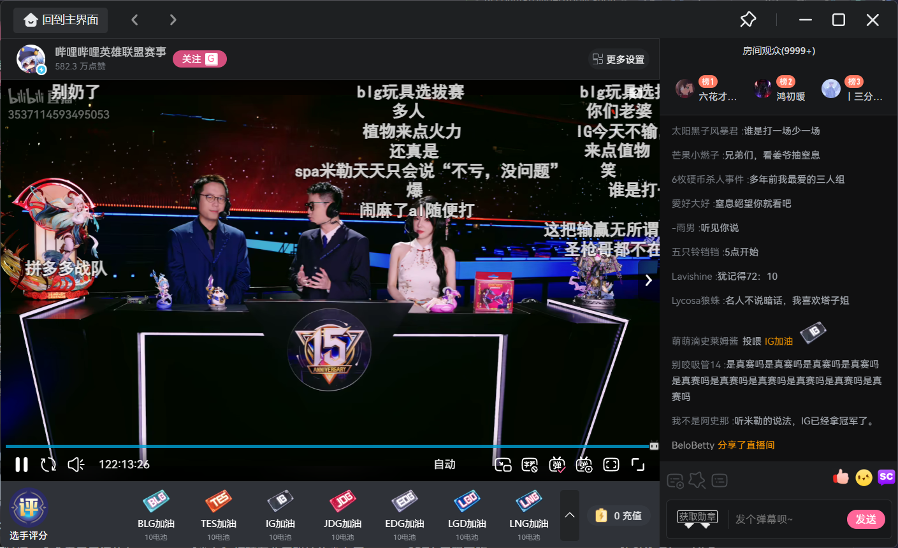

1. 设计如何支持bi栈这种的可以观看视频的 功能， 可以添加一个tab栏：比如：直播，视频 等等， 还是要用mimo 这类的存储还是说咋弄
2. 统一项目的日志风格
3. 前端界面优化， 不需要太ai味道，多元化， 直播的界面优化， 
4. 需要显示用户的金币数量，就是尽量贴合实际， 
5. 虽然是自己的项目。 但是我也希望它这个功能相对比较完善。 而不是说仅仅做一个demo。 尽量贴合抖音那种的平台的直播的风格，（左边是直播界面，下面是送礼物， 右边是聊天数据）
， 参考哔哩哔哩的可以做一下
6. 如果可以把所有的服务打包为镜像， 看能不能使用这个docker components这个 嗯，格式的一键启动。 
7. 做一下这个对账系统（一方面是为了面试，另一方面是为了了解这个对账系统咋实现的，学习学习）
8. 你看直播带货这个东西， 需要用户配置带货的东西，这个我举得 是不是需要一个界面， 让主播配置带货的内容 
9. 红包雨的特效 和功能也得实现以下
10. 送礼物的直播特效也得实现以下
11. 充值中心也有问题 也要完善，就是 有一个嗯配置的这个模板，就是里面有有一些商品，比如说10块钱10块人民币能兑换100个金币。 然后至于这个支付的逻辑，就不对接支付宝了吧，因为对接那个需要开一些账户，所以比较麻烦 
所以我的意思是，和这个项目中一样  BankApiApplication   嗯，在这个模块里面模拟一下就是支付成功的回调就好了。  
12. 还有这个 创建的这个直播间，嗯。 类型估计也得添加一下。  这个可以后面做。 
13. 按照综上所说的话，其实这个分为两个模块，一个就是视频模块，一个就是直播模块 然后每一个视频都有对应的这个标签，然后每一个这个直播也有对应的这个标签。
14. 估计还要有这个发布视频的这个这个功能。 嗯，所以我觉得估计这个视频。 这个功能你得单独开一个这个微服务出来。  数据库表那些你都自己看着办，看着设计就行，尽量风格统一一点就好  
15. 还有后面的功能，嗯，可能需要做一下，就是这个分账功能。 因为如果说视频有收益的情况下，就肯定需要涉及和平台的分账。 这些都是后话，后面再做。 
16. 之前，然后的话，既然做了这个视频功能，视频的点赞收藏分享这些功能估计也需要做。  肯定也要有这个用户设置这一块儿，就是用户的个性化这块儿肯定也需要做。 这一块的话就直接在用户模块里面做就好了。
10. 把待提交的代码提交以下

# todo
1. 对账系统，单独设计一个系统把， 单独一个 后端管理如何呢，对账不是给个人用的 ，给公司用的
2. 
